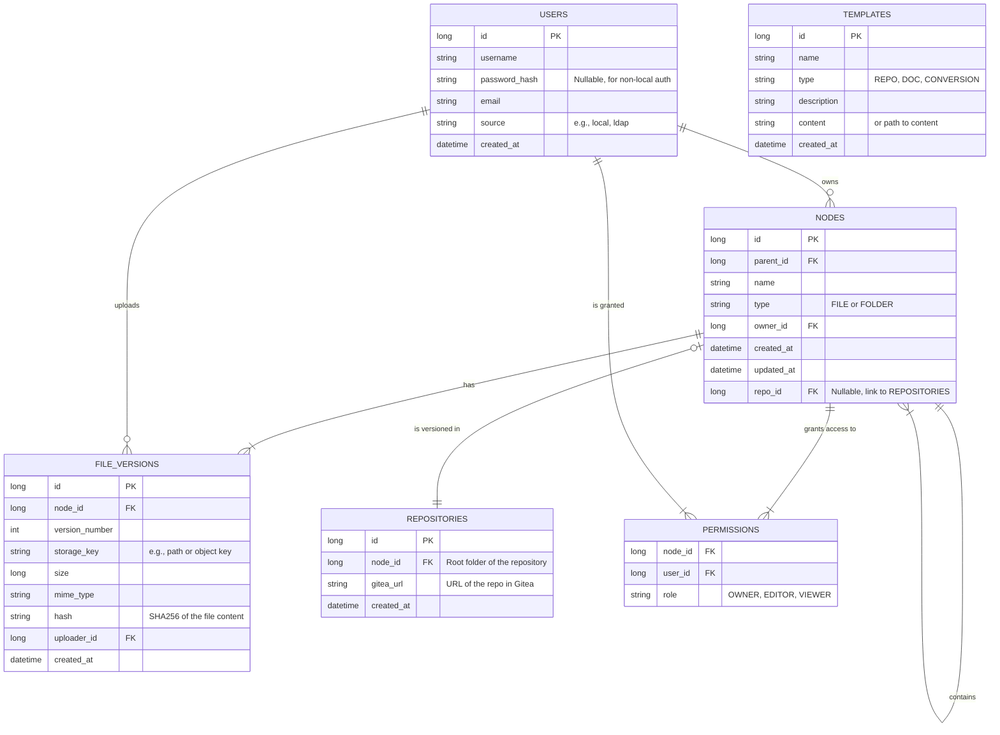

# Sextans - 企业级业务文档管理系统开发规划

## 1. 项目概述 (Project Overview)

Sextans (六分仪) 是一个现代化的企业级业务文档管理系统。它以插件化的方式构建，提供稳定、可扩展的文档管理核心能力，并能通过插件生态不断集成新功能，满足企业多样化的业务需求。项目旨在成为企业内部的知识枢纽，提升信息流转效率和数据资产价值。

**核心特性:**

- **基础能力:** 文件上传、存储、管理、预览、下载、共享、WebDAV 挂载。
- **插件化架构:** 系统的绝大部分高级功能（如多存储后端、用户集成、在线编辑、全文检索等）都将以插件形式提供。
- **技术栈:** 后端 Spring Boot 3, 前端 Vue 3。
- **开放与集成:** 拥抱开源，通过对接 OnlyOffice, OpenSearch, Pandoc 等成熟方案，快速构建强大功能。

## 2. 架构设计 (Architecture Design)

系统采用前后端分离的**模块化单体架构**，确保开发效率和未来的可扩展性。其核心设计理念是 **"微内核 + 强插件"**，即将绝对核心的功能内聚在主应用中，而将所有业务功能、外部集成和可变部分作为插件实现。

### 2.1. 核心与插件边界定义

- **核心系统 (Core System) - 不可插件化:**
  - **应用引导程序**: Spring Boot 应用的启动和基础配置。
  - **插件管理器 (PF4J)**: 负责插件生命周期（加载、启动、停止）的管理框架。
  - **插件接口 (plugin-api)**: 定义核心与插件之间通信的所有 Java 接口，是插件开发的契约。
  - **核心数据模型**: 最基础的业务实体，如 `Node` (文件节点)、`User` (基础用户属性)、`Permission` (权限元数据)、`Template` (模板定义)。
  - **文件元数据管理**: 文件和目录的创建、重命名、移动、删除等逻辑操作，管理的是数据库中的元数据记录。
  - **核心安全框架**: 基于 Spring Security 的认证授权流程骨架，但不包含具体的认证实现。
  - **模板管理系统**: 提供对各类模板（文档模板、仓库模板、转换模板）的 CRUD 管理和应用能力。
  - **前端基础 Shell**: Vue 应用的骨架，包括主布局、导航栏，以及动态加载插件前端模块的机制。
  - **默认实现**:
    - **默认数据库 (SQLite)**: 提供开箱即用的数据存储，无需额外配置。
    - **默认本地存储**: 提供基础的本地文件存储能力。

- **插件模块 (Plugins) - 必须插件化:**
  - **存储后端 (`Storage Plugin`)**: 实现 `StorageService` 接口，对接不同的物理存储系统。
    - *示例*: `local-storage` (默认启用), `minio-s3-storage`。
  - **数据库驱动 (`Database Plugin`)**: 提供特定数据库的 JDBC 驱动和 JPA/MyBatis 方言配置。
    - *示例*: `sqlite-db` (默认启用), `postgresql-db`, `mysql-db`。
  - **用户认证 (`Authentication Plugin`)**: 实现具体的认证逻辑。
    - *示例*: `db-auth` (默认启用), `ldap-auth`, `oauth2-auth`。
  - **版本控制 (`Version Control Plugin`)**: **核心功能插件**。负责所有版本控制相关操作。
    - **职责**: 实现 `VersionControlService` 接口，使用 **JGit** 在本地（服务器端）进行完整的 Git 操作（克隆、提交、变基、合并等），并使用 **Gitea API** 辅助完成仓库创建、权限同步等远程操作。这是本地 Git 能力和远程 Gitea 服务的桥梁。
    - *示例*: `gitea-vcs` (默认且必需的插件)。
  - **文档格式转换 (`Converter Plugin`)**: 提供文件内容从一种格式到另一种格式的转换能力，可由模板系统驱动。
    - *示例*: `pandoc-converter`, `ocr-converter`。
  - **文档在线预览/编辑 (`Viewer/Editor Plugin`)**: 集成外部文档服务。
    - *示例*: `onlyoffice-editor`。
  - **全文检索 (`Search Plugin`)**: 对接 OpenSearch 等检索引擎。
    - *示例*: `opensearch-search`。
  - **协议服务 (`Protocol Plugin`)**: 提供 WebDAV 等协议支持。
    - *示例*: `webdav-protocol`。
  - **AI 功能 (`AI Plugin`)**: 向量检索、知识提取等。
    - *示例*: `vector-search`, `knowledge-extractor`。

### 2.2. 总体架构图

```mermaid
graph TD
    subgraph "用户端"
        A[浏览器/Web] --> B[前端应用 (Vue 3)];
        C[本地文件系统] -- WebDAV --> D[Nginx/Gateway];
    end

    subgraph "服务端 (Sextans Core)"
        D -- HTTPS --> E[核心业务服务 (Spring Boot)];
        E -- manages --> F[插件管理器 (PF4J)];
        E -- uses --> DB_API{数据访问接口 (JPA)};
        E -- uses --> FS_API{文件存储接口};
        E -- uses --> VCS_API{版本控制接口};
        E -- uses --> TPL_MGR{模板管理系统};
    end

    subgraph "插件生态 (Plugins)"
        F -- loads --> P1[存储插件: Local, S3];
        F -- loads --> P2[用户认证插件: DB, LDAP];
        F -- loads --> P3[数据库插件: SQLite, PostgreSQL];
        F -- loads --> P4[版本控制插件: Gitea+JGit];
        F -- loads --> P5[功能插件: OnlyOffice, OpenSearch, ...];
    end
    
    subgraph "基础设施 (Infrastructure)"
        DB_API -- routed by P3 --> DB[SQLite / PostgreSQL];
        FS_API -- routed by P1 --> FS[本地磁盘 / MinIO S3];
    end

    subgraph "外部集成 (External Services)"
        P4 -- API & Git Protocol --> Gitea;
        P5 -- Integration --> OnlyOffice;
        P5 -- Integration --> OpenSearch;
    end

    B -- REST API --> D;
    P1 -- implements --> FS_API;
    P3 -- provides config for --> DB_API;
    P4 -- implements --> VCS_API;
```

### 2.3. 后端架构

- **技术选型:**
  - **框架:** Spring Boot 3, Spring Security
  - **语言:** Java 17+
  - **构建:** Maven
  - **默认数据库:** **SQLite**
  - **数据访问:** Spring Data JPA
  - **插件化:** PF4J
  - **版本控制集成:** **JGit**, Gitea API

### 2.4. 前端架构

- **技术选型:**
  - **框架:** Vue 3
  - **构建:** Vite
  - **状态管理:** Pinia
  - **路由:** Vue Router
  - **UI 库:** Element Plus
  - **语言:** TypeScript
- **模块划分:**
  - `core`: 核心逻辑，包括全局样式、工具函数、API 客户端基类、路由和状态管理的初始化等。
  - `plugins`: 存放插件对应的前端 UI 模块。每个插件可以暴露自己的路由、组件和状态模块，由主应用动态加载。

### 2.5. 数据模型 (E-R 图)



## 3. 开发任务拆解 (Task Breakdown)

### Phase 1: 核心系统与基础插件 (MVP)

> 目标：搭建包含模板系统的微内核，并实现最基础的文件管理和 **JGit** 集成。

| ID | 任务 | 模块 | 依赖 | 状态 |
|----|---|---|---|---|
| P1-1 | 初始化前后端项目，配置 Git Flow | `backend` `frontend` | - | Pending |
| P1-2 | 实现后端插件框架 (PF4J) 与主应用集成 | `backend/core` | P1-1 | Pending |
| P1-3 | 设计并实现核心数据模型（包括 `Template` 表）| `backend/core` | P1-1 | Pending |
| P1-4 | 实现可插拔的数据库机制，默认集成 SQLite | `backend/core` `plugins`| P1-2 | Pending |
| P1-5 | **实现核心的模板管理系统 API** | `backend/core` | P1-3 | Pending |
| P1-6 | 定义存储服务 `StorageService` 接口 | `backend/plugin-api` | P1-2 | Pending |
| P1-7 | 实现默认的本地文件存储插件 | `backend/plugins` | P1-6 | Pending |
| P1-8 | 实现基础用户注册/登录 (DB-Auth 插件) | `backend/plugins` | P1-4 | Pending |
| P1-9 | 实现文件（夹）列表、创建、上传、下载基础 API | `backend/core` | P1-7, P1-8 | Pending |
| P1-10| **定义版本控制 `VersionControlService` 接口** | `backend/plugin-api` | P1-2 | Pending |
| P1-11| **实现 Gitea/JGit 插件基础，能连接 Gitea** | `backend/plugins` | P1-10 | Pending |
| P1-12| 前端框架搭建，并开发基础模板管理页面 | `frontend` | P1-5 | Pending |
| P1-13| 开发前端文件系统主界面（登录、列表、上传） | `frontend` | P1-9, P1-12 | Pending |

### Phase 2: 版本控制与模板化功能闭环

> 目标：实现基于模板的仓库和文档创建，并打通 Git 提交流程。

| ID | 任务 | 模块 | 依赖 | 状态 |
|----|---|---|---|---|
| P2-1 | **实现"从模板创建 Gitea 仓库"功能** | `backend/plugins` | P1-5, P1-11 | Pending |
| P2-2 | **实现"从模板创建文档"功能（在文件系统）** | `backend` `frontend` | P1-5 | Pending |
| P2-3 | **将新创建的文档首次提交到 Git 仓库** | `backend/plugins` | P2-1, P2-2 | Pending |
| P2-4 | 实现文件内容编辑后，提交变更到 Gitea | `backend` `frontend` | P2-3 | Pending |
| P2-5 | 定义格式转换 `ConverterService` 接口 | `backend/plugin-api` | P1-2 | Pending |
| P2-6 | 实现 Pandoc 格式转换插件 | `backend/plugins` | P2-5 | Pending |
| P2-7 | **实现"从模板进行格式转换"功能** | `backend` `frontend` | P1-5, P2-6 | Pending |
| P2-8 | 设计并实现 RBAC 权限模型和 API | `backend/core` | P1-9 | Pending |
| P2-9 | 实现文件/文件夹共享功能 | `backend` `frontend` | P2-8 | Pending |
| P2-10| 实现 MinIO/S3 对象存储插件 | `backend/plugins` | P1-6 | Pending |

### Phase 3: 高级功能与集成

> 目标：提供在线预览、编辑、全文检索等高级功能。

| ID | 任务 | 模块 | 依赖 | 状态 |
|----|---|---|---|---|
| P3-1 | **创建 OnlyOffice 对接插件**，实现文档预览 | `backend/plugins` `frontend`| P1-11 | Pending |
| P3-2 | 扩展 OnlyOffice 插件，支持在线编辑和协同 | `backend` `frontend`| P3-1 | Pending |
| P3-3 | **创建 OpenSearch 对接插件** | `backend/plugins` | - | Pending |
| P3-4 | 实现文件内容变更时，异步写入 OpenSearch | `backend` | P3-3, P2-5 | Pending |
| P3-5 | 实现前端全局搜索框和搜索结果页 | `frontend` | P3-4 | Pending |
| P3-6 | 实现 LDAP 用户系统对接插件 | `backend/plugins` | P1-7 | Pending |
| P3-7 | **创建 WebDAV 协议插件** | `backend/plugins` | P2-7 | Pending |

### Phase 4: 智能化与未来

> 目标：引入 AI 能力，探索知识管理的新可能。

| ID | 任务 | 模块 | 依赖 | 状态 |
|----|---|---|---|---|
| P4-1 | 实现 Pandoc 对接插件，支持文档格式转换 | `backend/plugins` | P1-7 | Pending |
| P4-2 | 在 OpenSearch 中启用并配置向量检索能力 | `backend` | P3-2 | Pending |
| P4-3 | 实现文件内容向量化并索引的异步任务 | `backend` | P4-2 | Pending |
| P4-4 | 实现基于向量的相似文档推荐/搜索功能 | `backend` `frontend`| P4-3 | Pending |
| P4-5 | 实现知识提取（关键信息、摘要）插件 | `backend/plugins` | P4-3 | Pending |
| P4-6 | 开发 AI 助手 API，对接大语言模型 | `backend` `frontend`| P4-4 | Pending |

## 4. 插件开发规范

### 后端插件 (`backend/plugins/{plugin-name}`)

- 必须实现 `plugin-api` 中定义的接口。
- 每个插件是一个独立的 Maven 模块。
- 通过 `pom.xml` 管理自身依赖，避免与主应用或其他插件冲突。
- 插件入口类需继承 `org.pf4j.Plugin`。
- 通过 `@Extension` 注解暴露实现的服务。

### 前端插件 (`frontend/src/plugins/{plugin-name}`)

- 每个插件是一个独立的目录。
- 必须有一个 `index.ts` 作为入口文件，导出插件定义对象。
- 插件定义对象可包含：
  - `routes`: `RouteRecordRaw[]`，插件的路由。
  - `store`: Pinia store 定义。
  - `components`: 全局注册的组件。
- 主应用在初始化时，会动态加载所有插件并整合其路由和状态。

## 5. 目录结构说明

```
sextans/
├── api/                  # OpenAPI 规范
├── backend/              # 后端代码 (Spring Boot)
│   ├── app/              # 核心应用
│   ├── plugin-api/       # 插件接口定义
│   └── plugins/          # 各插件模块
├── deployment/           # 部署相关 (Dockerfile, k8s)
├── docs/                 # 项目文档
├── frontend/             # 前端代码 (Vue 3)
│   ├── public/
│   └── src/
│       ├── assets/
│       ├── components/   # 全局公共组件
│       ├── core/         # 核心逻辑 (axios, pinia, router)
│       ├── plugins/      # 各插件前端模块
│       ├── services/     # API 服务封装
│       └── views/        # 页面视图
└── scripts/              # 构建、部署等脚本
└── background.md         # 项目全局规则
```
